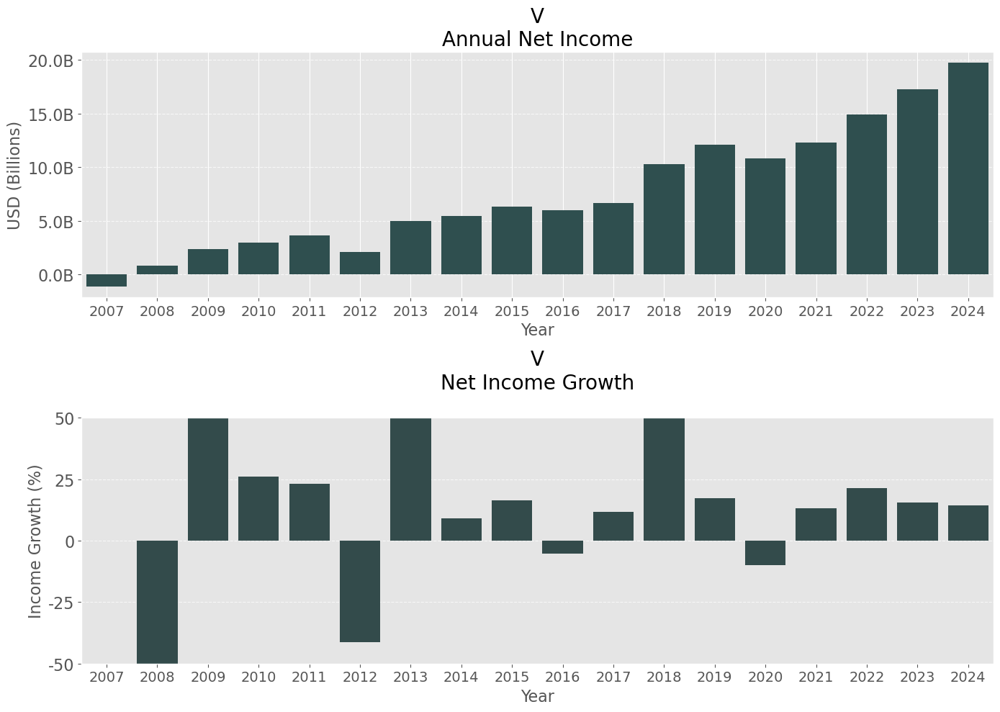
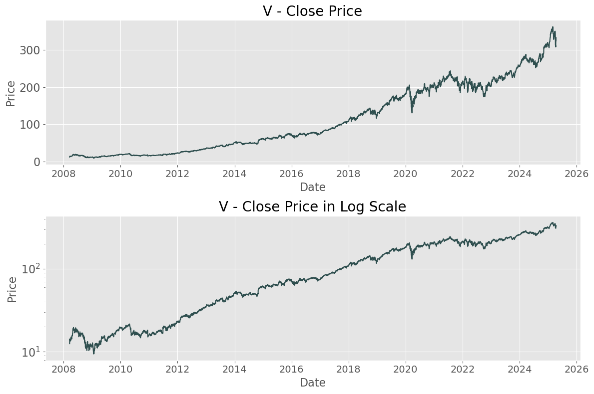
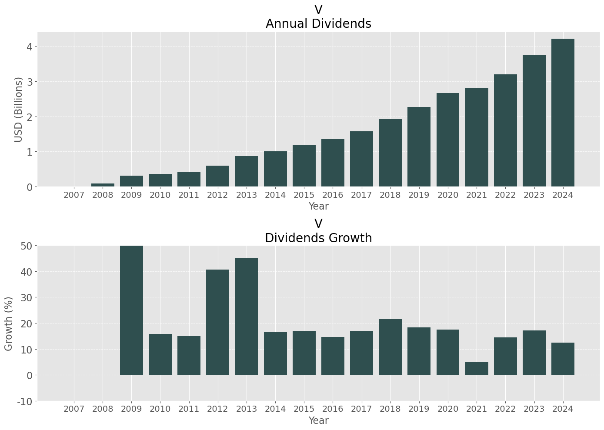
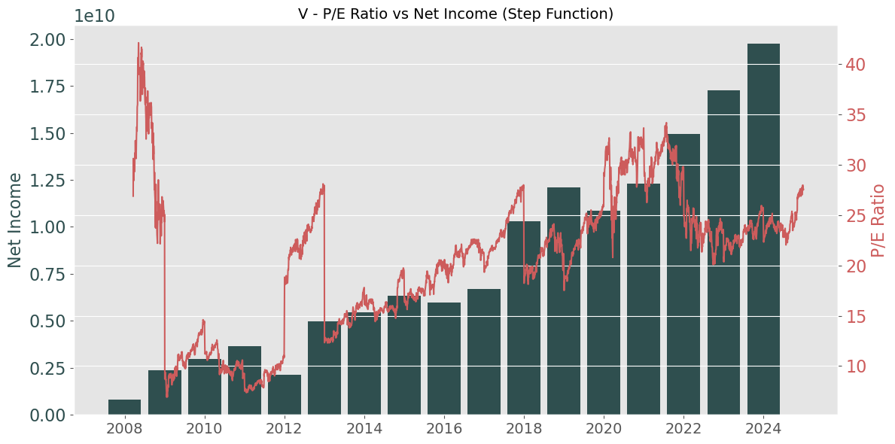

# 📈 Personal Stock Portfolio Tracker



Welcome to my personal stock portfolio tracker — a data-driven project built with **Python** and **Jupyter Notebook** to monitor and analyze individual stocks in my investment portfolio. 

I have made this repository to track long-term performance of each stocks. Google and Yahoo finance only showed the net income of recent 5 years.

This repository gets data from SEC EDGAR (using sec-edgar-api), and tracks net income history over decades. 

This repository includes tools for historical financial data, visualizing key metrics, and tracking performance over time.

---

## 🔧 Features

- Historical Net Income and Growth Rate (%)


- Historical Price and Price in Log Scale


- Dividends History


- Historical P/E Ratio (based on Annual Earnings)


---

## 📂 Repository Structure

If you want your own analysis, copy notebook from analysis folder and just simply change a ticker!

```bash
stock_portfolio/
│
├── README.md               ← This file!
├── .gitignore              
├── requirements.txt        
│
└── finance/                ← Python module
│   ├── __init__.py                      
│   ├── fundamentals.py     ← Net income, dividends (using sec-edgar-api)
│   └── prices.py           ← Historical price data (using yfinance)
│
└── analysis/               ← Analysis notebook for individual stocks
    ├── AAPL_2025.ipynb     
    │   ...
    └── V_2025.ipynb
```